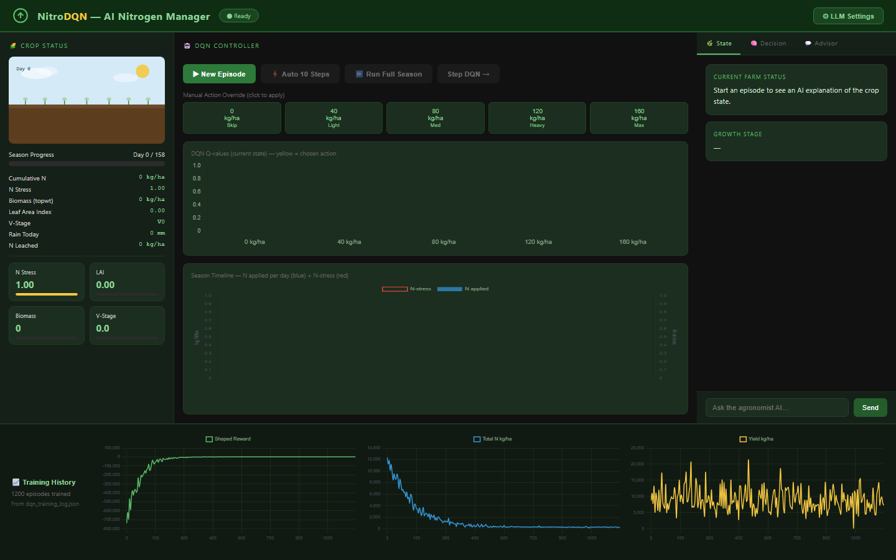
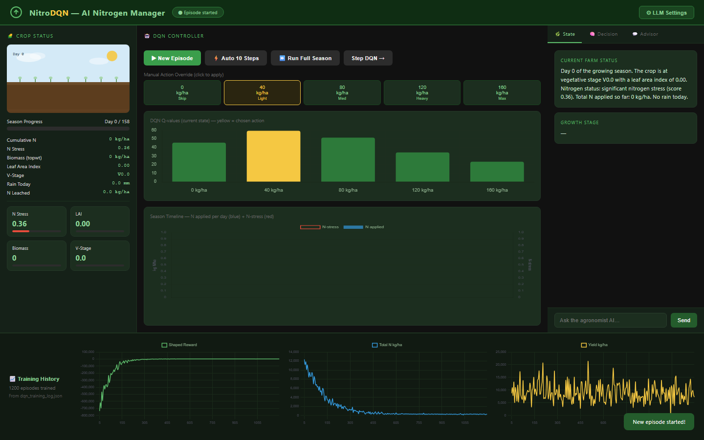
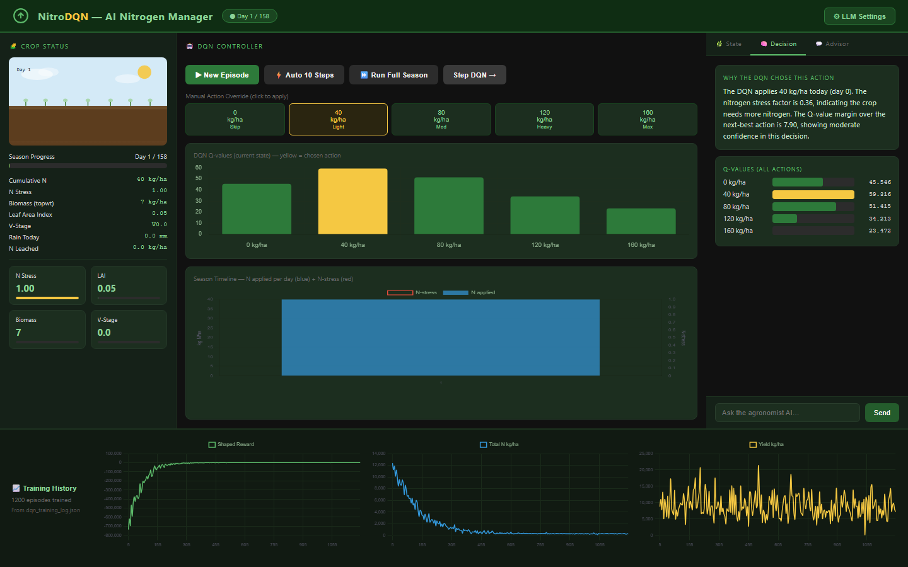
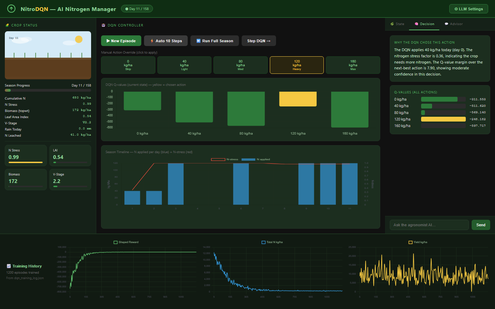
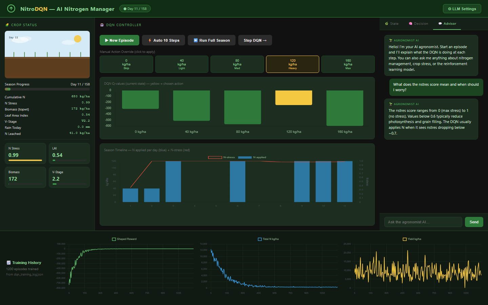
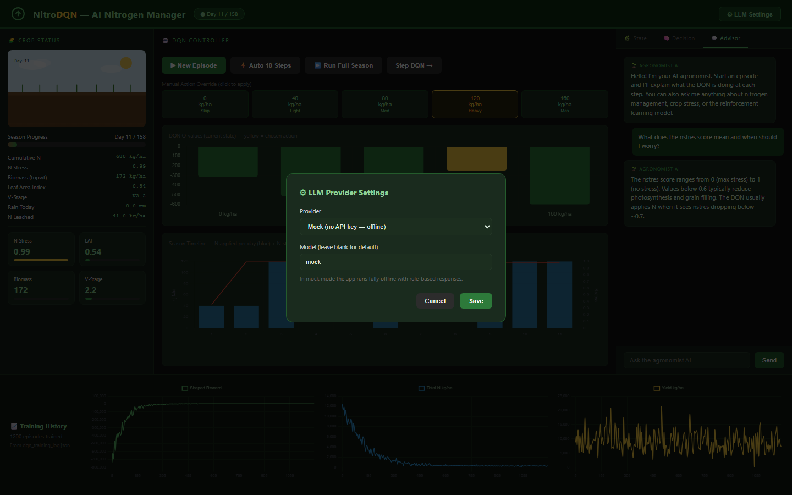

# NitroDQN Application

This section describes the web application built to demonstrate the trained
DQN agent and its LLM co-pilot. The application is a single-page dashboard
served by a FastAPI backend. It exposes the simulation loop, the agent's
internal Q-values, and a chat interface to a language model that explains the
agent's decisions in plain language.

## 1. Dashboard Overview

The landing view (Figure 1) gives the user a complete picture of the system
before any simulation is run. The left column reports the current crop status
(cumulative nitrogen, stress, biomass, leaf area index, vegetative stage,
rainfall, leached nitrogen). The centre column hosts the DQN controller
(episode controls, manual override doses, the live Q-value bar chart, and the
season timeline). The right column is reserved for the LLM co-pilot, organised
into three tabs (State, Decision, Advisor). The bottom row shows the
1200-episode training history loaded from `dqn_training_log.json`.

## 2. State Explainer

Once a season is started, the State tab (Figure 2) converts the raw
observation dictionary returned by the DSSAT-compatible environment into a
short natural-language summary aimed at a non-technical reader. The text is
produced by the LLM service from the current values of `nstres`, `xlai`,
`vstage`, `cumsumfert`, and `rain`.

## 3. Decision Narrator

After each step, the Decision tab (Figure 3) explains why the DQN chose a
particular fertilizer dose. The panel reports the chosen action, the Q-value
margin over the next-best action (a proxy for confidence), and the dominant
state variables that drove the choice. The Q-values for all five actions are
listed below the prose explanation so the user can compare the alternatives.

## 4. Season Progress and Manual Override

The "Auto 10 Steps" and "Run Full Season" buttons advance the simulation under
the greedy DQN policy without further input. The season timeline (Figure 4)
draws each applied dose as a blue bar and overlays the evolving N-stress
factor in red, making the relationship between fertilisation events and stress
response visible at a glance. The five dose buttons above the chart let the
user override the agent and apply any dose manually, which is useful for
comparing the learned policy against simple baselines.

## 5. Strategy Advisor (Chat)

The Advisor tab (Figure 5) is a free-form chat interface that takes the
current crop state as conversational context. The user can ask agronomic
questions ("what does the nstres score mean and when should I worry?") and
receive grounded answers from the language model. Conversation history is
preserved across turns within the same session.

## 6. LLM Provider Settings

The application is provider-agnostic. The settings modal (Figure 6) lets the
user switch between OpenAI, Anthropic Claude, a local Ollama endpoint, and an
offline mock provider that returns rule-based responses without an API key.
Provider, model name, key, and base URL are configurable at runtime.

## 7. Training History

The bottom strip (Figure 7) plots the metrics recorded during training:
shaped episodic reward, total nitrogen applied per episode, and final yield
per episode. These curves let the reader judge convergence of the DQN
independently of any single simulated season run in the demo.

## 8. Full Interface

Figure 8 shows the complete interface in a single full-page capture, with all
panels populated after a partial season has been simulated.

